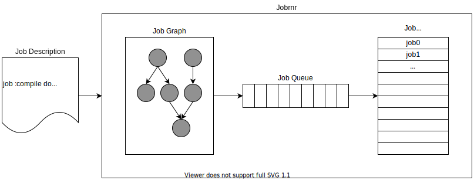

= Jobrnr

[link=https://travis-ci.org/rfdonnelly/jobrnr]
image::https://travis-ci.org/rfdonnelly/jobrnr.svg?branch=master[Build Status]

Jobrnr runs jobs.
Jobrnr is designed for use as a test runner for ASIC/FPGA development but it can run any command.

* A job can have prerequisite jobs.
* A job can be repeated many times.
* A job can be passed a random seed.
* Jobs are run in parallel where possible.
* Additional functionality can be added via plug-ins.

== Example Job Description

[source,ruby]
----
job :compile do
  execute 'make compile'
end

job :simulate, :compile do
  execute 'make simulate SEED=__SEED%x__'
  repeat 50
end
----

This job description specifies a single compilation job and a single simulation job.
The compilation job is a prerequisite for the simulation job.
The simulation job will not be executed until the compilation job completes successfully.
After the compile job completes successfully, 50 instances of the simulation job will be executed.
Each instance will execute with a random value for SEED.
The simulation job instances will be run simultaneously.

== Comparison to GNU Make

Jobrnr is similar to GNU Make in many ways but also differs in a few key ways.

* Targets -- GNU Make has the concept of targets.
The Jobrnr equivalent is job definitions.

* Dependencies -- Like Make targets, job definitions can depend on other job definitions.

* Top-level -- Unlike Make where one or more top-level targets are run, Jobrnr runs all top-level targets.

* Repetition -- Unlike Make, Jobrnr job definitions can be repeated.
This allows a job definition to be run multiple times, usually with command variation.

* Input -- Unlike Make, the Jobrnr input is Ruby.
This makes the job graph highly programmable.

* Parallelism -- Like Make, Jobrnr parallelizes jobs where possible.

== License

Licensed under either of

* Apache License, Version 2.0
+
(link:LICENSE-APACHE[LICENSE-APACHE] or http://www.apache.org/licenses/LICENSE-2.0)
* MIT license
+
(link:LICENSE-MIT[LICENSE-MIT] or http://opensource.org/licenses/MIT)

at your option.

== Contribution

Unless you explicitly state otherwise, any contribution intentionally submitted for inclusion in the work by you, as defined in the Apache-2.0 license, shall be dual licensed as above, without any additional terms or conditions.
